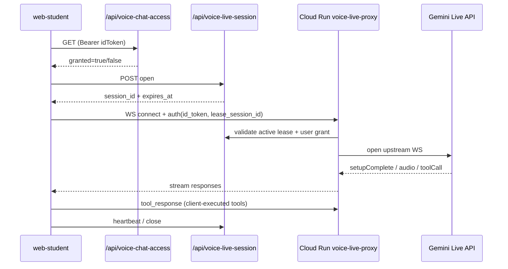

# LangBridge Backend

GCP Cloud Functions implementation of LangBridge API endpoints using CDK Terrain (CDKTN) for deployment.

## Structure

```
functions/
├── talk-stream/     # SSE streaming chat endpoint
├── welcome/         # Welcome message endpoint  
├── goodbye/         # Goodbye message endpoint
├── recquestions/    # Recommended questions endpoint
├── speech/          # TTS endpoint
├── config/          # Config + presentation broadcast endpoint
├── voice-chat/      # Backend voice assistant text/audio + command fallback
├── voice-chat-access/# Voice chat access check for signed-in users
├── voice-chat-admin/# Admin usage dashboard + limit controls API
└── voice-live-session/# Open/heartbeat/close lease API for Live voice sessions

live-proxy/
└── server.py         # Cloud Run WebSocket proxy to Gemini Live (auth + lease enforced)

cdktf/              # Infrastructure as Code
├── main.ts         # Main deployment stack
└── components/     # Reusable components
```

## Setup

1. Create an environment file and configure it:
   ```
   cp cdktf/.env.template cdktf/.env
   # or for a separate dev stack:
   # cp cdktf/.env.dev.template cdktf/.env.dev
   ```
   ```
   PROJECTID=your-gcp-project
   REGION=us-central1
   BILLING_ACCOUNT=your-billing-account
   GOOGLE_OAUTH_CLIENT_ID=...apps.googleusercontent.com
   GOOGLE_OAUTH_CLIENT_SECRET=...
   ```

2. Install dependencies:
   ```bash
   cd cdktf
   npm install
   ```

3. Deploy (Phase 1):
   ```bash
   cd ..
   ./deploy.sh
   ```

   Deploy a separate dev environment file:
   ```bash
   ./deploy.sh --env-file backend/cdktf/.env.dev
   ```

Then complete:
- **Phase 2 (Auth):** initialize Authentication in Firebase console for the client project, then run `bootstrap_client_auth.py`.
- **Phase 3 (Content):** run `backend/seeds/seed_course_content.py` to load slide text/audio/visual data.

## API Endpoints

- `POST /api/talk` - Streaming chat response (SSE)
- `POST /api/welcome` - Welcome/presentation message
- `POST /api/goodbye` - Goodbye message
- `POST /api/recquestions` - Recommended questions
- `POST /api/speech` - Text-to-speech and voice URL
- `POST /api/config` - Update Firestore config and live presentation broadcast
- `POST /api/voice-chat` - Backend voice assistant request (speech transcript -> answer/audio + commands)
- `GET /api/voice-chat-access` - Check if signed-in user is granted voice chat access
- `GET/POST /api/voice-chat-admin` - Admin access and limit management
- `GET/POST /api/admin-teachers` - Admin teacher-role grant/revoke and teacher listing
- `GET/POST /api/teacher-courses` - Teacher course management + class cloning/student status
- `GET/POST /api/student-courses` - Student class selection/enrollment/current view
- `GET /api/teacher-student-records` - Teacher-facing student study records + latest user settings
- `POST /api/voice-live-session` - Open/heartbeat/close short-lived voice live session lease

`talk-stream`, `welcome`, `goodbye`, `recquestions`, and `speech` use header-based request signature validation. `/api/config` is exposed through API Gateway key protection and updates Firestore-backed runtime state.

`/api/voice-chat-access` requires Firebase ID token authentication and returns whether the user is active in `voice_chat_users`.
`/api/voice-chat-admin` requires Firebase ID token authentication (`Authorization: Bearer <idToken>`) and admin access (custom claim, allowlist, or `admin_users` records). It supports:
- `GET`: dashboard summary + access user list
- `POST action=update_limits`: update per-minute/per-day limits
- `POST action=grant_voice_user`: grant voice access by email
- `POST action=revoke_voice_user`: revoke voice access by email
`/api/admin-teachers` requires Firebase ID token authentication + admin access and supports:
- `GET`: teacher list
- `POST action=grant_teacher`: grant teacher role by email (works before first login; resolves UID later when available)
- `POST action=revoke_teacher`: revoke teacher role by email
`/api/teacher-courses` requires teacher/admin access and supports:
- `GET`: list owned courses and classes
- `POST action=create_course`: create a teacher-owned course
- `POST action=update_course`: update course metadata
- `POST action=clone_class`: clone a course into an independent class instance
- `POST action=set_student_status`: update student status in class roster/enrollments by UID or email (email-only pending assignment supported before first login)
`/api/student-courses` requires Firebase ID token authentication and supports:
- `GET`: list selectable classes + enrollment state
- `POST action=enroll`: enroll/select a class
- `POST action=access_check`: verify class access (`enrolled student` / `class teacher` / `admin`)
- `POST action=current_view`: fetch class current presentation pointer (requires class access)
`/api/teacher-student-records` requires Firebase ID token authentication + admin access and returns:
- daily usage summary and top usage
- recent session logs
- latest per-user settings snapshot (display/audio language + autoplay + context)
`/api/voice-live-session` requires Firebase ID token authentication and active `voice_chat_users` access for every `open`, `heartbeat`, and `close` operation.
`/api/voice-chat` requires Firebase ID token authentication, active `voice_chat_users` access, and a valid lease session id issued by `/api/voice-live-session`.
`voice-live-proxy` (Cloud Run WebSocket service) bridges browser requests to Gemini Live after verifying Firebase ID token + live lease (`voice_live_sessions`).



## Voice Live proxy deployment

`voice-live-proxy` is deployed to Cloud Run by script (not as a first-class CDKTF resource yet):

```bash
PROJECTID=<backend-project-id> REGION=us-east1 bash backend/deploy_voice_proxy.sh
```
# xiaoice_class_assistant

### Login your GCP account
```
gcloud auth application-default login
```

### Create API Key

```
gcloud auth login
gcloud config set project <project-id>
gcloud auth application-default set-quota-project <project-id>
```

## Admin Tools

Tools in `admin_tools/` help manage API keys and pre-generate configuration.

### Pre-generate Presentation Messages from PPTX

To cache presentation messages from PowerPoint slides, use the `presentation-preloader` tool:

```bash
cd presentation-preloader
pip install -r requirements.txt
python main.py \
  --pptx /path/to/deck.pptx \
  --languages en,zh \
  --course-id "course_101"
```

This updates `presentation_messages` in Firestore (`langbridge_config/messages`), making `/api/welcome` responses faster by avoiding real-time generation.