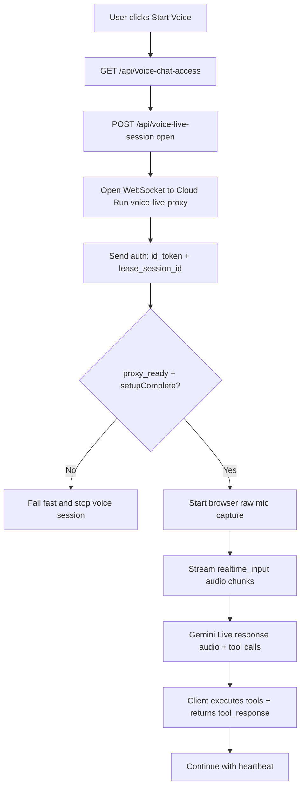

# LangBridge Student Client

The **LangBridge Student Client** is a real-time web application designed to provide students with an accessible, localized, and interactive way to follow classroom presentations.

It connects to the LangBridge backend via Firebase Firestore to receive live updates from the presenter's slides, translated into the student's preferred language with synchronized audio.

## 🚀 Features

### 🌐 Real-Time Translation & Synchronization
*   **Live Updates**: As the presenter changes slides, the new content appears instantly on the student's device.
*   **Multi-Language Support**: Students can switch languages on the fly. Language codes follow the **BCP-47** standard used by Google Cloud. Supported languages include:
    *   English (US) (`en-US`)
    *   Chinese (Mandarin - Simplified & Traditional) (`zh-CN`, `zh-TW`)
    *   Cantonese (Hong Kong) (`yue-HK`)
    *   Spanish (`es-ES`)
    *   Japanese (`ja-JP`)
    *   Korean (`ko-KR`)

### 🧭 Course/Class Selection + Teacher Workspace
*   **Student class selection**: Signed-in students land on a class-selection page (`/`) and can enroll/open classes before entering slide view.
*   **Class access control**: Class content reads are restricted to public classes, enrolled students, the class teacher, or admins.
*   **Teacher workspace**: Teacher users can open `/teacher-courses` to create courses, update course titles, and clone independent classes from courses.
*   **Course package workflow**: Teacher workspace supports linking a validated package manifest and creating classes from package content.
    * Required: `manifest_url` (HTTP/HTTPS) with `audio_url` / `image_url` entries
*   **Package registry linkage**: Linked packages are registered as `course_packages/{package_id}`, and courses/classes keep `package_id` references for stable long-term tracking.
*   **Self-upload support**: Teacher workspace can request signed upload URLs for package file paths, then link the uploaded package manifest.
*   **Admin teacher grant**: Admin users can grant/revoke teacher role on `/voice-admin`, then teachers manage their own course/class scope.

### 🔊 Smart Audio Player (Text-to-Speech)
*   **Auto-Play**: Automatically plays the audio narration for new slides as they arrive (can be toggled off).
*   **Intelligent Queuing**: Prevents audio overlap by queuing messages to play sequentially.
*   **Interactive Controls**: Play or pause specific messages at any time.

### 🎤 Voice Chat (Login Required)
*   **Sign-In Required for Class View**: Opening `/?class=...` requires sign-in and class access.
*   **Access Control**: Signed-in users must be explicitly granted in `voice_chat_users`.
*   **Gemini Live Proxy Policy**: Direct browser calls to Gemini Live are disabled. Voice chat must use a backend proxy path.
*   **Current Status**: Voice Start uses a Cloud Run WebSocket proxy to Gemini Live. The browser streams raw microphone PCM audio (`audio/pcm`, 16kHz) through the proxy via `realtime_input.media_chunks`, Gemini audio replies stream back, and tool-calling commands are executed in the web client.
*   **Gemini language behavior**: Voice chat is always auto-multilingual. There is no manual voice-chat language setting.
*   **Strict Auth Gate**: WebSocket session is allowed only after Firebase ID token + voice grant + active lease validation.
*   **No Fallback**: If proxy/auth/context is invalid, the session stops immediately. No direct browser Gemini path and no fallback model path.
*   **Server Lease Enforcement**: Live session start/heartbeat/close must pass backend lease checks (`/api/voice-live-session`) with expiry enforcement.
*   **Admin Controls**: Admin users can manage voice-chat users and limits on a dedicated page: `/voice-admin` (not embedded in slide view).
*   **iOS Chrome Limitation**: Voice chat is intentionally blocked on iPad/iPhone Chrome (`CriOS`). Use Safari on iOS devices.

### 🗣️ Voice Commands (Accessibility)

Voice tools are mode-scoped and loaded per page:

*   **Course selection page (`/`)**: `list available courses`, `open class <class_id>`, `list slide languages`, `list shortcuts`, `help commands`
*   **Presentation page (`/?class=...`)**: slide navigation (`next/previous`, `go to slide`, `first/last`), topic selection (`list/select presentation`), language controls (`change display language`, `change narration language`), playback controls, fullscreen controls, and shortcuts/help tools

When page mode changes, the active voice session is stopped and must be started again so Gemini gets the correct tool set for that page.

### ⌨️ Keyboard Shortcuts

*   **Navigation**: `←` / `→` (prev/next slide), `L` (toggle Live Sync), `Esc` (close fullscreen or stop narration)
*   **Languages**: `Alt+V` (cycle display language), `Alt+A` (cycle narration language)
*   **Player**: `Space` (play/pause), `R` (restart narration), `S` (stop), `A`/`D` (seek -10s / +10s), `Shift+A`/`Shift+D` (seek -30s / +30s), `Home` (jump to start)
*   **Voice**: `M` (toggle voice chat start/stop)

### 🎧 Narration + Voice Chat Interaction Rules

*   **Narration language source of truth**: narration playback always follows the Narration Language selector (`listenLang`), including `Restart (R)`.
*   **Voice + narration run together by default**: narration is not blocked when voice chat starts.
*   **After first play**: narration follows slide/audio changes continuously.
*   **Voice narration commands** (`play/resume/restart`) trigger immediate narration playback and keep follow mode on.



Admin users can be managed from backend with:

```bash
cd backend/admin_tools
python manage_admin_users.py --project-id <backend-project-id> --database langbridge grant --email "admin@example.com" --note "voice dashboard admin"
python manage_admin_users.py --project-id <backend-project-id> --database langbridge list --active-only
```

Voice chat user access can be managed with:

```bash
cd backend/admin_tools
python manage_voice_chat_users.py --project-id <backend-project-id> --database langbridge grant --email "student@example.com" --note "voice access"
python manage_voice_chat_users.py --project-id <backend-project-id> --database langbridge list --active-only
```

The `/voice-admin` dashboard now includes teacher-facing visibility for:
- per-user access settings (audio language, display language, autoplay, latest presentation)
- study records from voice sessions (top daily usage and recent session logs)

### ♿ Accessibility & UI
*   **Adjustable Font Size**: Easy-to-use `A+` / `A-` controls to adjust text size for better readability.
*   **Mobile-First Design**: Fully responsive layout that works perfectly on smartphones, tablets, and laptops.
*   **Status Indicators**: Clear visual feedback for the connection status (🟢 Live, 🟡 Waiting, 🟠 Connecting).
*   **Context Snippets**: Displays a small preview of the original slide content for reference.

## 🛠️ Tech Stack

*   **Frontend Framework**: [React](https://react.dev/) (v19)
*   **Build Tool**: [Vite](https://vitejs.dev/)
*   **Data & Sync**: [Firebase Firestore](https://firebase.google.com/docs/firestore) (Real-time listeners)
*   **Routing**: React Router

## 🏃‍♂️ Getting Started

### Prerequisites
*   Node.js (v18 or higher)
*   npm

### 1. Installation

Navigate to the project directory and install dependencies:

```bash
cd client/web-student
npm install
```

### 2. Environment Configuration (Handled by Root Deployment)

Firebase configuration for this client is automatically generated and updated by the main `./deploy.sh` script in the project root. You do not need to manually create or update a `.env` file for deployment.

However, for **local development (`npm run dev`)**, ensure that a `.env` file exists in this directory (`client/web-student/.env`) with your Firebase configuration. This file is automatically generated by the root `./deploy.sh` script after the infrastructure is provisioned.

For voice chat, the env also needs:

```bash
VITE_API_BASE_URL=https://<api-gateway-hostname>
VITE_FIREBASE_APPCHECK_SITE_KEY=<recaptcha-enterprise-site-key>
VITE_VOICE_LIVE_PROXY_WS_URL=wss://<voice-live-proxy-host>
VITE_GCP_PROJECT_ID=<backend-project-id>
VITE_VOICE_LIVE_MODEL_LOCATION=us-central1
VITE_VOICE_NAME=Aoede
```

When grounding is enabled in code, the setup includes both `google_search` and `function_declarations` so web grounding and client tool-calling can run together in one Live session.

### 3. Run Locally

Start the development server:

```bash
npm run dev
```

Access the app at `http://localhost:5173`.

**URL Parameters:**
To join a specific class/course, append the `class` parameter:
`http://localhost:5173/?class=demo`

Direct class URLs require sign-in plus class access (enrolled student / class teacher / admin).

### 4. Build & Deploy (Handled by Root Deployment)

The build and deployment to Firebase Hosting for this client are automatically managed as part of the main `./deploy.sh` script located in the project root.

## 📂 Project Structure

*   **`src/App.jsx`**: Main application logic, including Firestore listeners, audio state management, and UI rendering.
*   **`src/firebase.js`**: Firebase initialization and configuration.
*   **`src/index.css`**: Global styles and UI theming.
*   **`firestore.rules`**: Security rules for the database (read-only for students).

## 🔍 Troubleshooting

*   **No Audio**: Most browsers block auto-playing audio until the user has interacted with the page. Click anywhere on the page to enable audio.
*   **"Waiting..." Status**: This means the client is connected but hasn't found an active session for the specified Course ID. Ensure the presenter has started the session.
*   **Live API handshake error (`AI/response-error`, missing `setupComplete`)**: In Firebase Console for the client project, open **AI Logic** and finish enable/setup. Also confirm `firebasevertexai.googleapis.com` is enabled for the client project.
*   **Voice chat unavailable on iPad/iPhone Chrome**: This is expected. iOS Chrome uses WKWebView and is not supported for this Live voice flow. Use Safari.