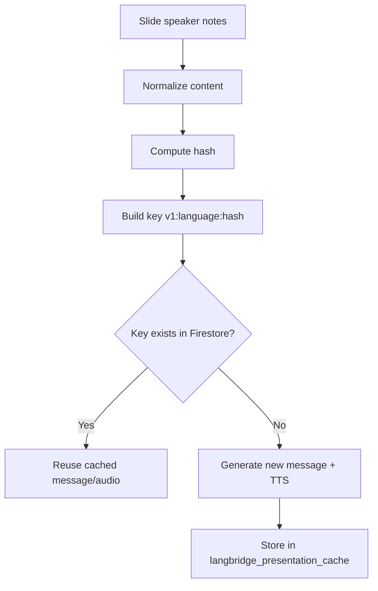
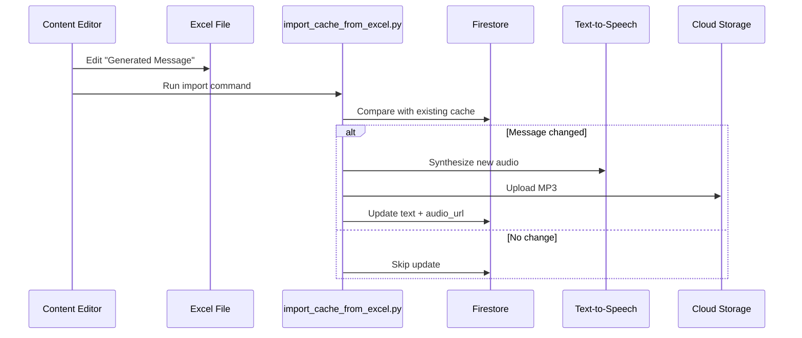

# Admin Tools & Content Management

The `backend/admin_tools` directory contains scripts for managing courses, presenters, and system configuration.

## Content Delivery Architecture

The system uses a **registry-based architecture** for presentation content delivery.

### How It Works
1. **Seeding Phase**: All presentation content (text, audio, visuals) is pre-generated and stored in the Firestore registry
2. **Live Presentation**: VBA client sends slide changes → Backend fetches complete data from registry → Broadcasts to web clients
3. **Web Client**: Receives live updates or browses the registry for slide content

**Registry Structure**: `presentation_broadcast/{courseId}/presentations/{pptId}/slides/{slideNum}`

This ensures:
- **Instant Delivery**: No runtime AI generation needed
- **Consistent Quality**: All content is pre-reviewed and refined
- **Reliable Audio**: Audio URLs are guaranteed to exist
- **Simple Architecture**: Single source of truth in the registry



## Tools

### 1. Content Seeding (`seed_course_content.py`)

Pre-generates all presentation content and populates the Firestore registry.

**Location**: `backend/seeds/`

**Purpose**: Converts pre-translated slide notes and visuals into a complete presentation registry with text, audio, and visual links.

**Input Requirements**:
- Progress JSON files with slide notes (e.g., `{basename}_en_progress.json`, `{basename}_zh-CN_progress.json`)
- Visual images in folders (e.g., `{basename}_en_visuals/slide_0_reimagined.png`)
- PowerPoint files (for metadata)

**Usage**:
```bash
cd backend/seeds

# Seed a presentation
python seed_course_content.py \
  --course-id showcase \
  --course-title "Showcase" \
  --data-dir generate \
  --languages en-US zh-CN yue-HK

# Skip course creation if it already exists
python seed_course_content.py --skip-create --course-id showcase --data-dir generate
```

**What it does**:
1. Creates/updates the course in Firestore
2. Loads pre-translated text from progress JSON files
3. Generates TTS audio for each language (or uses existing)
4. Uploads audio files to Cloud Storage
5. Uploads visual images to Cloud Storage
6. Writes complete slide data to the registry
7. Sets the live pointer to the first slide

**Features**:
- Parallel processing for speed
- Idempotent (skips existing files)
- Supports refined progress files (`*_progress_refined.json`)
- Automatic audio URL generation



### 2. `manage_courses.py`

Manages Course Configurations (languages, voices, etc.).

**Language Codes**: These follow the **BCP-47** standard (e.g., `en-US`, `zh-CN`, `yue-HK`).

**Usage:**

```bash
# Create or Update a course
python manage_courses.py update --id "course_101" --title "Intro to AI" --langs "en-US,zh-CN,yue-HK"

# List all courses
python manage_courses.py list
```

### 3. Content Preparation Workflow

Before seeding, you need to prepare the content files:

**Step 1: Extract Slide Notes**
- Export speaker notes from PowerPoint to text files
- Organize by language (e.g., `presentation_en.txt`, `presentation_zh-CN.txt`)

**Step 2: Generate Progress Files**
- Use translation tools or AI to create progress JSON files
- Format: `{basename}_{lang}_progress.json`
- Structure:
```json
{
  "slides": {
    "0": {
      "slide_index": 0,
      "note": "Translated slide text here"
    }
  }
}
```

**Step 3: Prepare Visuals**
- Create or generate slide images
- Organize in folders: `{basename}_{lang}_visuals/`
- Naming: `slide_{num}_reimagined.png`

**Step 4: Run Seeding**
- Place all files in the `backend/seeds/generate/` directory
- Run `seed_course_content.py` as shown above

### 4. `manage_presenters.py`

Manages Presenter Configurations (name, language, background).

**Usage:**

```bash
# Create or Update a presenter
python manage_presenters.py create --id "summer" --name "Summer" --language "en-US" --background "Friendly AI assistant"

# Batch import from JSON files
python manage_presenters.py batch-import --dir ./presenters/

# List all presenters
python manage_presenters.py list
```

**Multiple Presenters in Presentations:**

When configuring your VBA client or Python client, you can specify multiple presenters using comma-separated IDs:

```
# In api_config.txt (Line 4)
cyber,honey,summer
```

This allows:
- Multiple AI agents to share the same presentation context
- All specified presenters receive slide updates
- Collaborative presentations with different AI personalities

### 5. `create_api_key.py` / `delete_api_key.py`

**Purpose**: Manage API keys for the API Gateway.

**Usage**:
```bash
# Create an API key for a digital human
python create_api_key.py <digital_human_id> <name>

# Example
python create_api_key.py 12345678 "Cyrus"

# Delete an API key
python delete_api_key.py <api_key_string>
```

**Note**: The API key will be automatically added to Firestore and restricted to the configured API service. The key details are saved to a JSON file in the current directory.

## Environment Setup

The admin tools require a Python environment with dependencies installed and proper GCP authentication configured.

### Quick Setup

```bash
cd backend/admin_tools

# Option 1: Use the automated setup script
./setup.sh

# Option 2: Manual setup
python3 -m venv venv
source venv/bin/activate
pip install -r requirements.txt

# Configure Application Default Credentials quota project
gcloud auth application-default set-quota-project langbridge-presenter
```

### Authentication Requirements

⚠️ **Important**: Before running any admin tools, ensure you have:

1. **Authenticated with GCP**: Run `gcloud auth login` if you haven't already
2. **Set the correct project**: `gcloud config set project langbridge-presenter`
3. **Configured ADC quota project**: `gcloud auth application-default set-quota-project langbridge-presenter`

The quota project ensures that API calls are billed to the correct GCP project, especially important when working with multiple projects or when the default credentials point to a different/deleted project.
