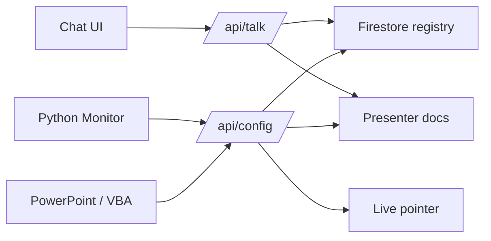
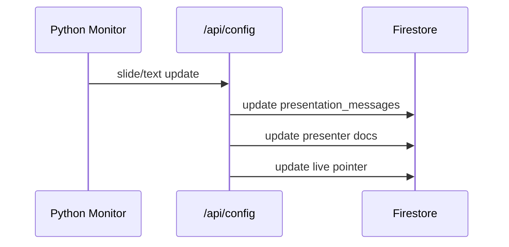

# System Architecture

The LangBridge is a comprehensive system designed to enhance presentations and classroom interactions using AI. It consists of a serverless backend on Google Cloud Platform and client-side applications for real-time context monitoring.

## High-Level Overview

The system follows a client-server architecture where client applications (PowerPoint, Desktop Monitor) send context (slide notes, screen content) to a backend API. The backend processes this context using Large Language Models (Gemini) to generate relevant speech or chat responses.

```mermaid
graph TD
    User[User/Presenter] -->|Uses| PPT[PowerPoint (VBA)]
    User -->|Uses| Monitor[Window Monitor (Python)]
    User -->|Interacts| Chat[Chat Interface]

    subgraph "Client Side"
        PPT -->|Sends Slide Notes| API[API Gateway]
        Monitor -->|Sends OCR Text| API
    end

    subgraph "Backend (GCP)"
        API -->|Routes| CF[Cloud Functions]
        
        CF -->|Read/Write| Firestore[(Firestore DB)]
        CF -->|Read/Write| Storage[(Cloud Storage)]
        
        subgraph "Cloud Functions"
            Talk[Talk Stream]
            Welcome[Welcome]
            Goodbye[Goodbye]
            Config[Config/Cache]
        end
        
        Config -->|Pre-generated| Firestore
        Talk -->|Stream Response| Chat
    end

    subgraph "AI Services"
        CF -->|Inference| Gemini[Gemini 1.5 Flash]
    end
```



## Components

### 1. Backend
- **Infrastructure**: Managed via CDK Terrain (CDKTN).
- **Compute**: Google Cloud Functions (Gen 2) for serverless execution.
- **API**: Google API Gateway for routing and security (API Keys).
- **Database**: Firestore for storing configuration, session state, and cached messages.
- **Storage**: Cloud Storage for artifacts.
- **AI**: Integration with Gemini 1.5 Flash for text generation.

### 2. Clients
- **VBA Client (PowerPoint)**: 
    - Embeds into PowerPoint presentations.
    - Detects slide changes.
    - Sends speaker notes to the backend to prime the AI context.
    - Supports content-based caching to handle slide reordering.
- **Python Client (Window Monitor)**:
    - Runs on the presenter's machine.
    - Periodically captures the screen or specific windows.
    - Uses OCR (Tesseract) to extract text.
    - Sends text changes to the backend to keep the AI aware of the visual context.



### 3. Admin Tools
- **Seeding Script**: Pre-generates all presentation content (text, audio, visuals) and populates the registry.
- **Course Management**: Tools to create and configure courses with language and voice settings.
- **Presenter Management**: Tools to create and manage AI presenter profiles.
- **Key Management**: Tools to generate and revoke API keys.

## Data Flow

1. **Context Update**:
   - **PowerPoint**: When a slide changes, the VBA macro extracts speaker notes and sends them to the `/config` endpoint.
   - **Monitor**: When screen text changes, the Python monitor sends the new text to the backend.
   - **Presenter Context**: The `/config` endpoint updates presenter documents in Firestore with current slide information.
   
2. **Registry-Based Content Delivery**:
   - All presentation content (text, audio, visuals) is pre-generated during seeding.
   - Content is stored in the presentation registry in Firestore.
   - The backend fetches complete slide data from the registry when needed.
   - No runtime AI generation for presentation slides (instant delivery).

3. **Interaction**:
   - Users ask questions via the chat interface.
   - The `talk-stream` function retrieves the current context (set by clients).
   - It loads presenter context from Firestore, including all slides in the presentation.
   - It appends the user question and streams the AI's response back.

## Presenter System

The system supports multiple AI presenters that can share presentation context:

- **Presenter Configuration**: Each presenter has a unique ID, name, language preference, and background.
- **Multiple Presenters**: Clients can specify comma-separated presenter IDs (e.g., `cyber,honey,summer`) to enable collaborative presentations.
- **Context Sharing**: When multiple presenters are specified:
  - All presenters receive slide context updates
  - The first presenter's language and settings are used for welcome messages
  - The AI agent has access to all presenters' contexts
- **Lazy Loading**: The `talk-stream` function lazy-loads all slides from the presentation on-demand, providing full context to the AI agent.

## Security
- **Request Authentication**:
  - Talk/welcome/goodbye/recquestions/speech endpoints validate signed headers (`X-Timestamp`, `X-Key`, `X-Sign`).
  - Config updates are protected at API Gateway using API key enforcement.
- **Firestore Rules**: Data access is controlled via security rules.
