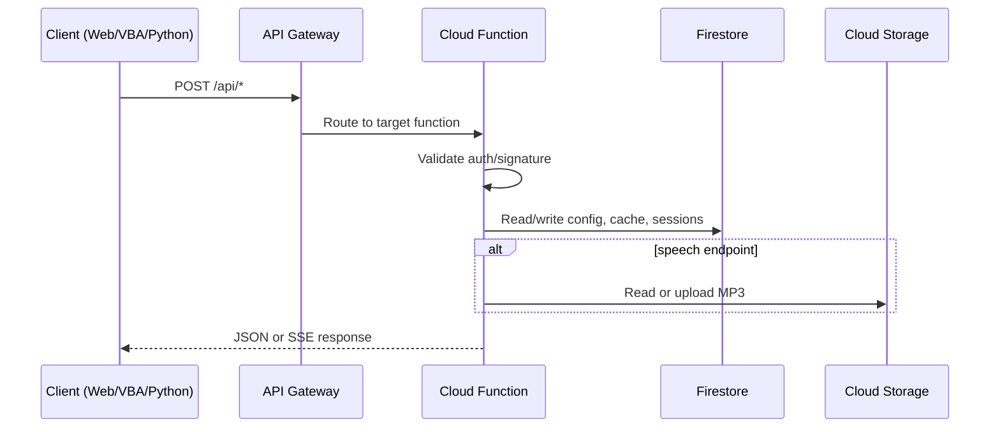
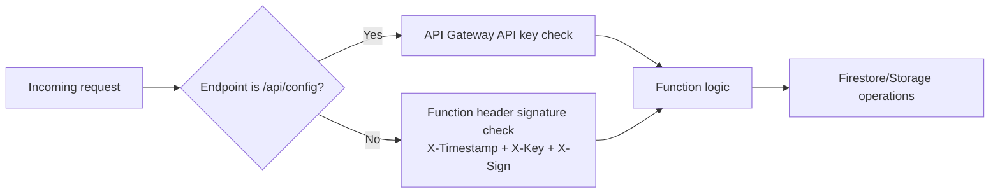

# Backend Documentation

The backend is built on Google Cloud Platform (GCP) using a serverless architecture. It is deployed and managed using the Cloud Development Kit for Terraform (CDKTF).

## Infrastructure

The infrastructure code is located in `backend/cdktf/`.

- **Language**: TypeScript
- **Stack**: `LangBridgeApiStack`
- **Resources**:
    - **Cloud Functions (Gen 2)**: Python 3.11 runtimes.
    - **API Gateway**: Routes requests to functions.
    - **Firestore**: NoSQL database for state and cache.
    - **Cloud Storage**: Stores function source code.

## Request Flow Diagram

## Cloud Functions

Located in `backend/functions/`.

### 1. Talk Stream (`talk-stream`)
- **Path**: `/api/talk`
- **Method**: POST
- **Purpose**: Handles user chat interactions.
- **Features**:
    - Streams responses using Server-Sent Events (SSE).
    - Maintains conversation history.
    - Uses a "Root Agent" configuration (`root_agent.yaml`) to define the AI persona.

### 2. Welcome (`welcome`)
- **Path**: `/api/welcome`
- **Method**: POST
- **Purpose**: Returns a greeting message when the application starts.
- **Logic**:
    - Supports `languageCode`, `sessionId`, and `traceId` in request body.
    - If `userParams` indicates presentation context, it returns `presentation_messages` from Firestore config.
    - Otherwise it returns `welcome_messages`.

### 3. Goodbye (`goodbye`)
- **Path**: `/api/goodbye`
- **Method**: POST
- **Purpose**: Returns a farewell message.

### 4. Config (`config`)
- **Path**: `/api/config`
- **Method**: POST
- **Purpose**: Updates the current session context.
- **Usage**: Called by clients (VBA, Python Monitor) to push slide notes or screen text.

### 5. RecQuestions (`recquestions`)
- **Path**: `/api/recquestions`
- **Method**: POST
- **Purpose**: Generates recommended questions for the user to ask, based on the current context.

### 6. Speech (`speech`)
- **Path**: `/api/speech`
- **Method**: POST
- **Purpose**: Converts selected welcome/presentation text to speech (TTS) and returns `voiceUrl`.
- **Storage**: Uses the configured `SPEECH_FILE_BUCKET` and reuses cached MP3 files by content hash.

## Request Authentication

Runtime auth behavior is split between API Gateway and function-level checks:

- **`/api/talk`, `/api/welcome`, `/api/goodbye`, `/api/recquestions`, `/api/speech`**
  - Validate custom headers: `X-Timestamp`, `X-Key`, `X-Sign`
  - Signature is generated from request body + timestamp + secret key.
- **`/api/config`**
  - Enforced by API Gateway API key (`key` query parameter in gateway spec).
  - Function itself currently validates method/body and writes config + broadcast state.

## Data Model (Firestore)

The backend uses Firestore for persistence.

- **Collection**: `langbridge_presentation_cache`
    - Stores pre-generated messages for slide content.
    - **Key Format**: `v1:{language}:{hash(content)}`
- **Collection**: `courses`
    - Stores course-specific configurations (languages, voices).
- **Collection**: `sessions` (implied)
    - Stores active conversation state.

## Deployment

Full deployment instructions, including prerequisites and configuration, are available in **[Deployment Guide](DEPLOYMENT.md)**.

The backend is deployed as part of the unified system using the `./deploy.sh` script at the project root.
