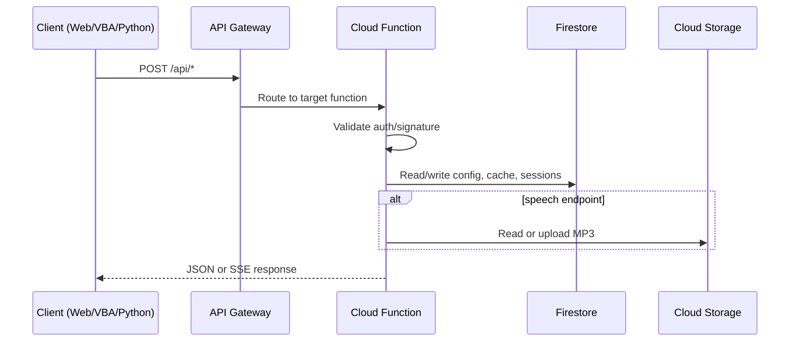
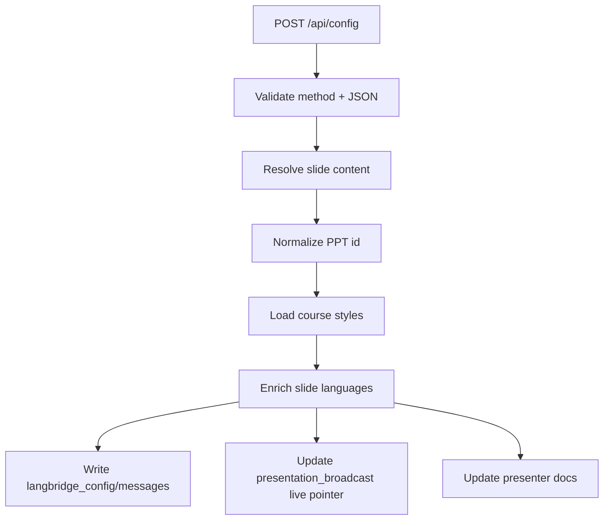
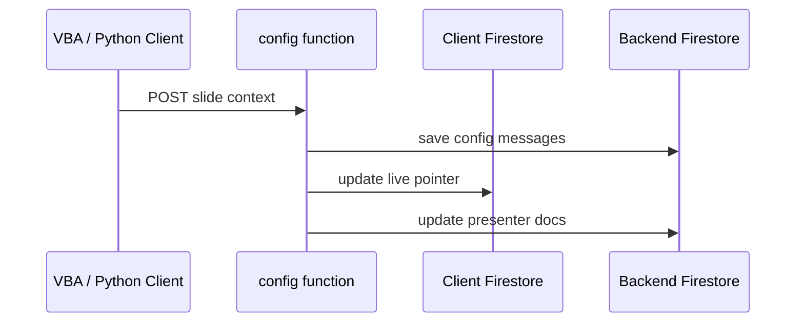
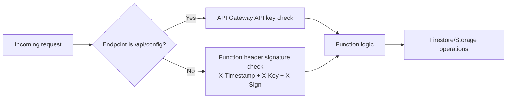
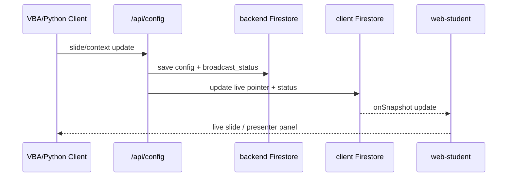
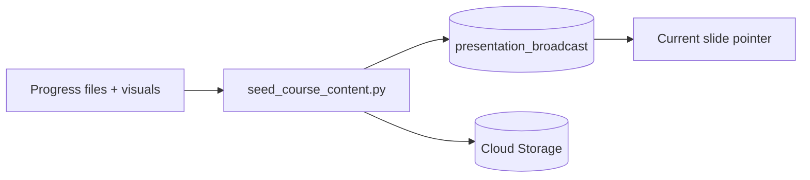

# Backend Documentation

The backend is built on Google Cloud Platform (GCP) using a serverless architecture. It is deployed and managed using CDK Terrain (CDKTN).

## Infrastructure

The infrastructure code is located in `backend/cdktf/`.

- **Language**: TypeScript
- **Stack**: `LangBridgeApiStack`
- **Resources**:
    - **Cloud Functions (Gen 2)**: Python 3.11 runtimes.
    - **API Gateway**: Routes requests to functions.
    - **Firestore**: NoSQL database for state and cache.
    - **Cloud Storage**: Stores function source code.

## Request Flow Diagram



## Config Broadcast Flow



## Cloud Functions

Located in `backend/functions/`.

### 1. Talk Stream (`talk-stream`)
- **Path**: `/api/talk`
- **Method**: POST
- **Purpose**: Handles user chat interactions.
- **Features**:
    - Streams responses using Server-Sent Events (SSE).
    - Maintains conversation history.
    - Uses a "Root Agent" configuration (`root_agent.yaml`) to define the AI persona.
    - Supports multiple presenters via comma-separated presenter IDs
    - Loads and merges presenter contexts (uses first presenter's course/presentation context)

### 2. Welcome (`welcome`)
- **Path**: `/api/welcome`
- **Method**: POST
- **Purpose**: Returns a greeting message when the application starts.
 - **Logic**:
    - Supports `languageCode`, `sessionId`, and `traceId` in request body.
    - Can be personalized based on the current context or time of day.
    - If `userParams` indicates presentation context, it returns `presentation_messages` from Firestore config.
    - Otherwise it returns `welcome_messages`.
- **Features**:
    - Supports multiple presenters via comma-separated presenter IDs
    - Uses first presenter's language and current slide context for welcome message

### 3. Goodbye (`goodbye`)
- **Path**: `/api/goodbye`
- **Method**: POST
- **Purpose**: Returns a farewell message.

### 4. Config (`config`)
- **Path**: `/api/config`
- **Method**: POST
- **Purpose**: Updates the current session context.
- **Usage**: Called by clients (VBA, Python Monitor) to push slide notes or screen text.
- **Features**:
    - Supports multiple presenters via comma-separated presenter IDs in `userParams.presenterId`
    - Updates all specified presenters with current slide context
    - Broadcasts slide updates to client applications
    - Persists a compact `broadcast_status` summary and returns it to the caller



### 5. RecQuestions (`recquestions`)
- **Path**: `/api/recquestions`
- **Method**: POST
- **Purpose**: Generates recommended questions for the user to ask, based on the current context.

### 6. Speech (`speech`)
- **Path**: `/api/speech`
- **Method**: POST
- **Purpose**: Converts selected welcome/presentation text to speech (TTS) and returns `voiceUrl`.
- **Storage**: Uses the configured `SPEECH_FILE_BUCKET` and reuses cached MP3 files by content hash.

## Request Authentication

Runtime auth behavior is split between API Gateway and function-level checks:

- **`/api/talk`, `/api/welcome`, `/api/goodbye`, `/api/recquestions`, `/api/speech`**
  - Validate custom headers: `X-Timestamp`, `X-Key`, `X-Sign`
  - Signature is generated from request body + timestamp + secret key.
- **`/api/config`**
  - Enforced by API Gateway API key (`key` query parameter in gateway spec).
  - Function itself currently validates method/body and writes config + broadcast state.



## Data Model (Firestore)

The backend uses two Firestore databases:

### Backend Database (`langbridge`)
- **Collection**: `courses`
    - Stores course-specific configurations (languages, voices).
    - **Fields**: `id`, `title`, `supported_languages`, `voice_configs`
- **Collection**: `presenters`
    - Stores presenter-specific context and state.
    - **Fields**:
        - `id`: Presenter identifier
        - `name`: Presenter display name
        - `language`: Preferred language code
        - `background`: Presenter background/bio
        - `current_course_id`: Active course
        - `current_presentation_id`: Active presentation
        - `current_slide_id`: Current slide number
        - `current_slide_languages`: Current slide content in all languages
    - **Multiple Presenters**: The system supports comma-separated presenter IDs, allowing multiple AI agents to share the same presentation context.
- **Collection**: `langbridge_config`
    - Stores system configuration and messages.
    - Includes the latest `broadcast_status` summary from `/api/config`
- **Collection**: `sessions` (implied)
    - Stores active conversation state.

### Client Database (`default`)
- **Collection**: `presentation_broadcast`
    - **Document**: `{courseId}` - Live pointer to current slide
            - **Fields**: `current_presentation_id`, `current_slide_id`, `latest_languages`, `broadcast_status`, `updated_at`
    - **Subcollection**: `presentations/{pptId}` - Presentation registry
        - **Subcollection**: `slides/{slideNum}` - Individual slide data
            - **Fields**:
                - `languages`: Map of language codes to content
                    - `{lang}`: `{text, audio_url, slide_link}`
                - `page_number`: Slide number
                - `source_context`: Original slide notes
                - `updated_at`: Timestamp

### Data Flow
1. **Seeding**: Pre-generates all content and populates the registry
2. **Live Presentation**: VBA sends slide changes → Backend fetches from registry → Updates live pointer
3. **Web Client**: Listens to live pointer or browses registry for slide content



## Content Seeding

Before using the system, presentation content must be pre-generated and seeded into the registry.

### Seeding Process

Located in `backend/seeds/seed_course_content.py`.

**Purpose**: Pre-generates all presentation content (text translations, audio files, visual links) and populates the Firestore registry.

**Input**: 
- Progress JSON files with pre-translated slide notes (e.g., `{basename}_en_progress.json`, `{basename}_zh-CN_progress.json`)
- Visual images (e.g., `slide_0_reimagined.png`)
- PowerPoint files (for metadata)

**Output**:
- Text content stored in Firestore registry
- Audio files (MP3) uploaded to Cloud Storage
- Visual images uploaded to Cloud Storage
- Complete slide data in `presentation_broadcast/{courseId}/presentations/{pptId}/slides/{slideNum}`

**Usage**:
```bash
cd backend/seeds
python seed_course_content.py \
  --course-id showcase \
  --course-title "Showcase" \
  --data-dir generate \
  --languages en-US zh-CN yue-HK
```

**Features**:
- Parallel processing for faster seeding
- Skips existing audio/visual files (idempotent)
- Supports refined progress files (`*_progress_refined.json`)
- Sets live pointer to first slide after seeding



## Deployment

Full deployment instructions, including prerequisites and configuration, are available in **[Deployment Guide](DEPLOYMENT.md)**.

The backend is deployed as part of the unified system using the `./deploy.sh` script at the project root.
