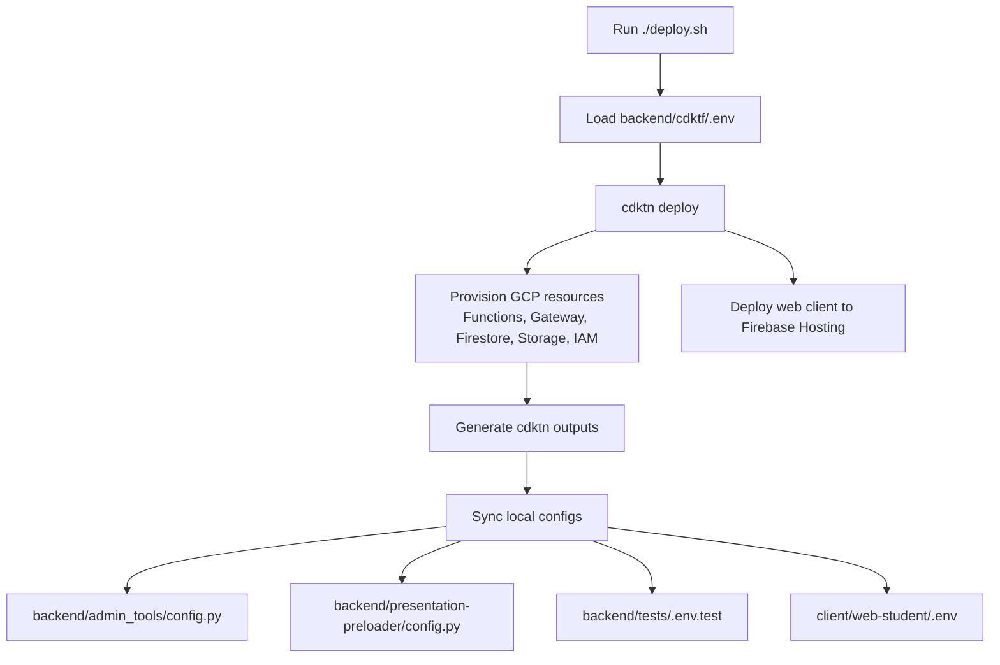
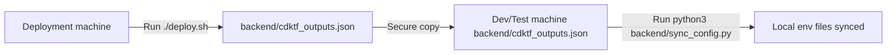

# Deployment Guide

This guide covers the complete deployment process for the LangBridge Presenter system, including the serverless backend (Google Cloud Platform) and the student web client (Firebase Hosting).

## Overview

The system uses **Terraform** (via CDK Terrain / CDKTN) as the Infrastructure-as-Code tool to provision all resources. A unified deployment script `deploy.sh` is provided to orchestrate the process.

**What gets deployed:**
1.  **Google Cloud Infrastructure**:
    *   Cloud Functions (2nd Gen)
    *   API Gateway & Config
    *   Firestore Database
    *   Cloud Storage Buckets
    *   IAM Roles & Service Accounts
2.  **Firebase Resources**:
    *   Firebase Project configuration
    *   Firebase Hosting site
    *   Web App registration
3.  **Web Client**:
    *   Builds the React application (`client/web-student`)
    *   Deploys static assets to Firebase Hosting

## Deployment Flow Diagram



## Prerequisites

Before running the deployment, ensure you have the following installed and authenticated:

1.  **Google Cloud CLI (`gcloud`)**:
    *   Install: [https://cloud.google.com/sdk/docs/install](https://cloud.google.com/sdk/docs/install)
    *   Login: `gcloud auth login`
    *   Set Project: `gcloud config set project <YOUR_PROJECT_ID>`
    *   Auth defaults: `gcloud auth application-default login`

2.  **Firebase CLI**:
    *   Install: `npm install -g firebase-tools`
    *   Login: `firebase login`

3.  **Node.js & npm**:
    *   Required for CDK Terrain and the Web Client build.
    *   Version 18+ recommended.

4.  **Python 3.11+**:
    *   Required for backend scripts and tests.

## Configuration

The system uses an environment file in `backend/cdktf/` as source of truth (for example `.env` or `.env.dev`).

1.  Navigate to `backend/cdktf/`.
2.  Copy the template:
    ```bash
    cp .env.template .env
    # optional: dedicated dev stack
    # cp .env.dev.template .env.dev
    ```
3.  Edit `.env` with your specific values:
    ```env
    PROJECTID=your-google-cloud-project-id
    BILLING_ACCOUNT=your-billing-account-id
    REGION=us-east1
    
    # API Keys for the AI Service (e.g., Xiaoice / Azure OpenAI)
    XIAOICE_CHAT_SECRET_KEY=your_secret_key
    XIAOICE_CHAT_ACCESS_KEY=your_access_key
    ```

**Important:** This `.env` file drives both the infrastructure provisioning and the runtime configuration of the backend and frontend.

## Deployment (3 Phases)

Current deployment should be treated as a 3-phase workflow.

### Phase 1: Provision infra + web hosting

Run from repo root:

```bash
./deploy.sh --env-file backend/cdktf/.env.dev
```

This provisions backend/client projects, API Gateway, Cloud Functions, storage buckets, and deploys the web app to Firebase Hosting.

### Phase 2: Initialize client auth

For a fresh client project, initialize Firebase Authentication in the Firebase console first:
1. Open Firebase Console for the client project (for dev: `langbridge-presenter-d2-client`)
2. Open **Authentication**
3. Enable Google provider

Then run bootstrap:

```bash
python3 backend/admin_tools/bootstrap_client_auth.py --outputs-file backend/cdktf_outputs.json
```

If you want Google provider configured by script, set these env vars before running bootstrap:
- `GOOGLE_OAUTH_CLIENT_ID`
- `GOOGLE_OAUTH_CLIENT_SECRET`

### Phase 3: Seed presentation content

Seed pre-generated text/audio/visual content to client Firestore and speech bucket:

```bash
PYTHONPATH=backend/admin_tools \
backend/.venv/bin/python backend/seeds/seed_course_content.py \
  --course-id showcase \
  --course-title Showcase \
  --data-dir generate \
  --languages en-US zh-CN yue-HK
```

Without this phase, slides/audio can be missing even if infra deploy succeeds.

## Verification

After all 3 phases, verify:

1.  **Web app is live**: open hosting URL (dev example: `https://langbridge-presenter-d2-client.web.app/?courseId=showcase`)
2.  **Gateway is reachable**: check API endpoints from your network
3.  **Seed data exists**: `presentation_broadcast/showcase` and media URLs are populated

Optionally run integration tests:
    ```bash
    cd backend/tests
    ./run_tests.sh
    ```

## Troubleshooting

### "Error: backend/cdktf/.env not found"
*   Ensure you have created the `.env` file in `backend/cdktf/` as described in the Configuration section.

### Permission Errors
*   Ensure your `gcloud` user has the `Owner` or `Editor` role on the GCP project.
*   Ensure the `Cloud Resource Manager API` is enabled on your project.

### Firebase Deploy Failures
*   If the web client deployment fails during the Terraform run, check that you are logged into Firebase (`firebase login`).
*   You can manually retry the web client deployment (after infrastructure is up) by navigating to `client/web-student` and running `npm run build && firebase deploy`.

### `CONFIGURATION_NOT_FOUND` during sign-in
*   The client Firebase Auth config is not initialized yet.
*   Complete Phase 2 (open Authentication in Firebase console, then run `bootstrap_client_auth.py`).

### `ERR_CERT_AUTHORITY_INVALID` / `Failed to fetch` for `*.gateway.dev`
*   This is typically network TLS interception / DNS security filtering, not CDK deployment failure.
*   Try a clean network (hotspot/VPN) or allowlist `*.gateway.dev` in your network security policy.

### Live API handshake error (`setupComplete` missing / `AI/response-error`)
*   If voice chat shows: `Server connection handshake failed... setupComplete message`, Firebase AI Logic is not fully enabled for the **client project** yet.
*   In Firebase Console (client project), open **Build → AI Logic** and complete the enable/setup flow.
*   Also ensure API is enabled:
    ```bash
    gcloud services enable firebasevertexai.googleapis.com --project <client-project-id>
    ```
*   Then hard refresh the web app and retry voice chat.

## Multi-Machine Workflow (Dev/Test)

If you need to run development or tests on a machine **different** from the one where you deployed the infrastructure:

1.  **On the Deployment Machine**:
    *   Run `./deploy.sh`.
    *   Locate the generated file: `backend/cdktf_outputs.json`.
    *   Securely copy this file to the `backend/` directory on your Dev/Test machine.

2.  **On the Dev/Test Machine**:
    *   Ensure the repository is cloned.
    *   Place `cdktf_outputs.json` inside `backend/`.
    *   (Optional) If you need access to the secret keys (`XIAOICE_CHAT_SECRET_KEY`), either:
        *   Create a `.env` file in `backend/cdktf/` with those keys.
        *   **OR** export them as environment variables in your shell.
    *   Run the sync script manually:
        ```bash
        python3 backend/sync_config.py
        ```
    *   This will configure your local environment (`tests/.env.test`, `client/web-student/.env`, etc.) using the deployment outputs from the other machine.


